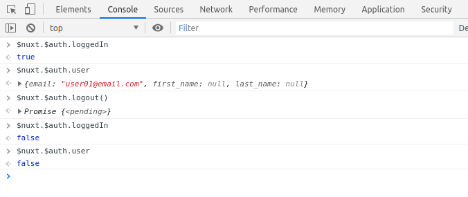

# railsnuxt1-frontend

> My swell Nuxt.js project

## Build Setup

```bash
# install dependencies
$ npm install

# serve with hot reload at localhost:3000
$ npm run dev

# build for production and launch server
$ npm run build
$ npm run start

# generate static project
$ npm run generate
```

For detailed explanation on how things work, check out [Nuxt.js docs](https://nuxtjs.org).

---------------------------------------------------------------------------------------------

Comando útiles al usar **nuxtjs/auth**



Comprobar si el *login* está activo
~~~console
$nuxt.$auth.loggedIn
~~~

Obtener datos del usuario *leagueado*
~~~console
$nuxt.$auth.user
~~~

Cerrar la sesión de usuario iniciada
~~~console
$nuxt.$auth.logout()
~~~

Obtener token
~~~console
$nuxt.$auth.getToken('local')
~~~

* Axios: https://github.com/axios/axios, https://axios.nuxtjs.org/extend.html